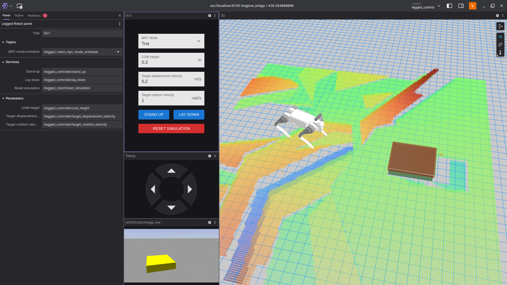

<!-- <p align="center">
  <a href="" rel="noopener">
 </a>
</p> -->

<h1 align="center">foxglove-legged-robot</h1>

<div align="center">

  [](https://github.com/leggedrobotics-usp/foxglove-legged-robot/issues)
  
  [](https://github.com/leggedrobotics-usp/foxglove-legged-robot/network)
  [](https://github.com/leggedrobotics-usp/foxglove-legged-robot/stargazers)
  [](https://github.com/leggedrobotics-usp/foxglove-legged-robot/blob/main/LICENSE)

</div>

---

<p align="center"> A Foxglove user interface for legged robots
    <br>
</p>

## 📝 Table of Contents
- [About](#about)
- [Getting Started](#getting_started)
- [Usage](#usage)
- [Feature requests](#feature_requests)
- [Contributing](#contributing)
- [Author](#author)

## 🧐 About <a name = "about"></a>

Your user-friendly interface for controllling legged robots is here! **foxglove-legged-robot** creates a [Foxglove](https://foxglove.dev/) panel for easily interacting with almost any legged robot compatible with open-source frameworks such as [legged_control](https://github.com/qiayuanl/legged_control) the signal.

## 🏁 Getting Started <a name = "getting_started"></a>
This repo is a standard Foxglove extension, built according to the [create-foxglove-extension](https://github.com/foxglove/create-foxglove-extension) standard.

### 🛠 Prerequisites

- [foxglove_bridge](https://github.com/foxglove/ros-foxglove-bridge)
    - Required to communicate ROS2 and Foxglove. Install using apt:

    ```bash
    sudo apt install ros-$ROS_DISTRO-foxglove-bridge
    ```

    - **Run** the bridge node whenever you want to connect Foxglove and the ROS2 network

    ```bash
    ros2 run foxglove_bridge foxglove_bridge
    ```

### 💻 Installing

As mentioned above, this is a standard Foxglove extension. Thus, you can install it using *npm*:

```bash
git clone https://github.com/leggedrobotics-usp/foxglove-legged-robot.git
cd foxglove-legged-robot
npm run local-install
```

## 🎈 Usage <a name="usage"></a>

After installing the extension, add it to your Foxglove layout. It interacts with your legged robot framework using ROS topics, services and parameters. The latest version offers the following features:

- MPC mode scheduling (a.k.a. gait type)
  - Publishes to the corresponding topic according to [OCS2](https://github.com/leggedrobotics/ocs2) MPC standars.
- COM height
  - Sets the corresponding parameter
- Target displacement velocity
  - Sets the corresponding parameter
- Target rotation velocity
  - Sets the corresponding parameter
- Stand up (button)
  - Calls the corresponding service (std_srvs/Trigger)
- Lay down (button)
  - Calls the corresponding service (std_srvs/Trigger)
- Reset simulation (button)
  - Calls the corresponding service (std_srvs/Trigger)



## 🔋 Feature requests <a name="feature_requests"></a>

Want something more on the interface? Open an *Enhancement* issue describing it.

## 🤝 Contributing <a name="contributing"></a>

- Fork the repo
  - <https://github.com/leggedrobotics-usp/foxglove-legged-robot/fork>
- Check out a new branch based and name it to what you intend to do:
  - ````bash
    git checkout -b BRANCH_NAME
    ````
- Commit your changes
  - Please provide a git message that explains what you've done;
  - Commit to the forked repository.
    ````bash
    git commit -m "A short and relevant message"
    ````
- Push to the branch
  - ````bash
    git push origin BRANCH_NAME
    ````
- Make a pull request!

## ✍️ Author <a name = "author"></a>

<a href="https://github.com/Vtn21">
 
 <br />
 <sub><b>Victor T. N. 🤖</b></sub></a>

Made with ❤️ by [@Vtn21](https://github.com/Vtn21)

<!-- [](mailto:victor.noppeney@usp.br) -->

<!-- -  - Idea & Initial work -->

<!-- See also the list of [contributors](https://github.com/kylelobo/The-Documentation-Compendium/contributors) who participated in this project. -->
